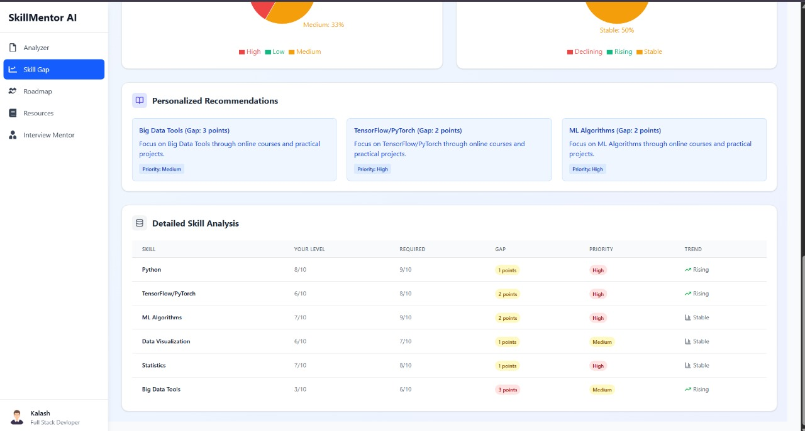
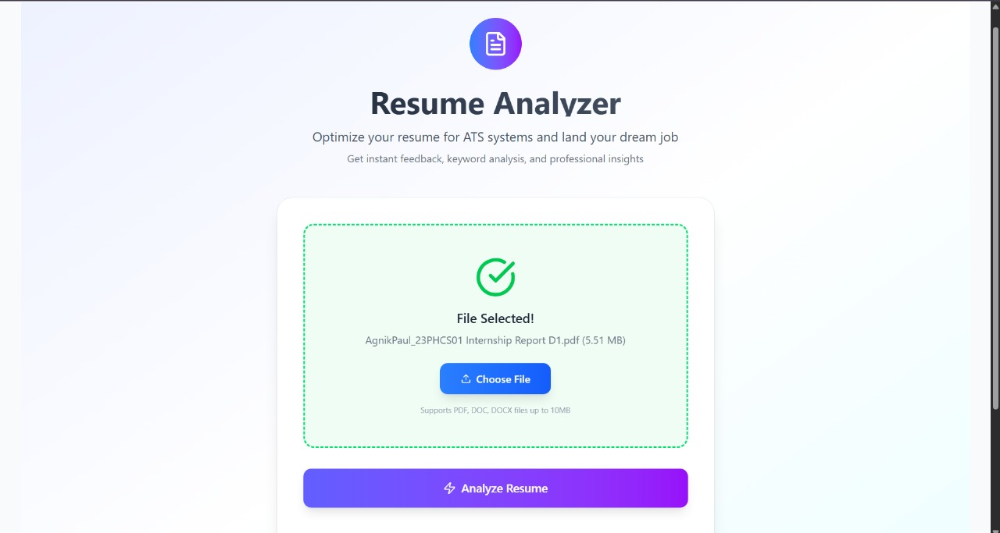
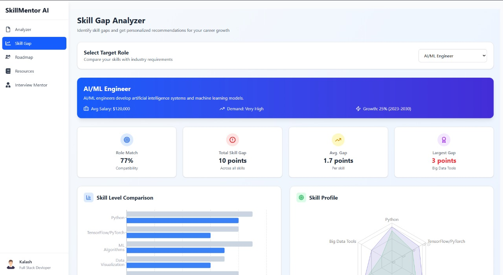
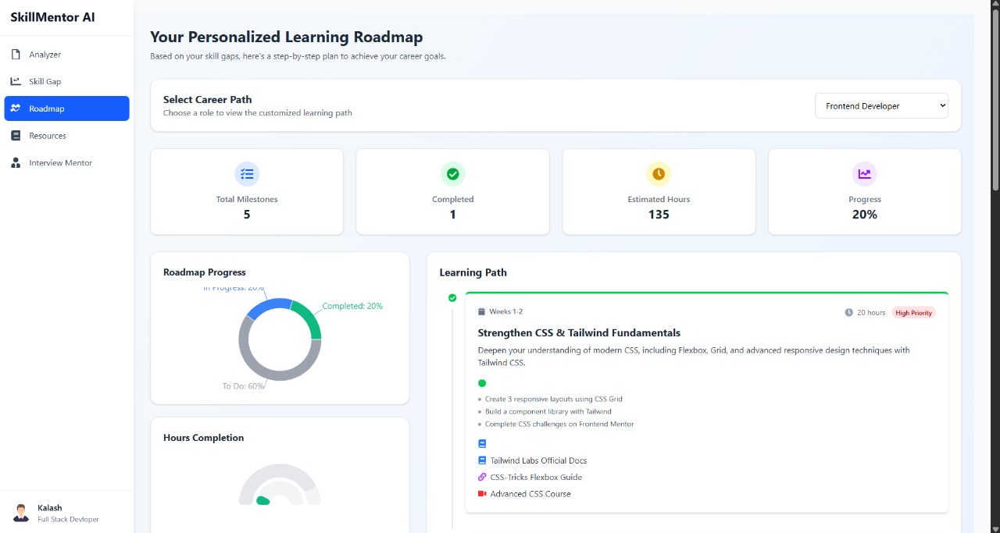
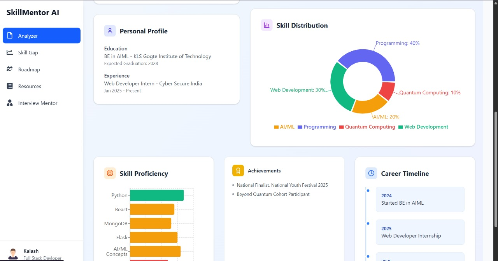

# SkillAdvisor AI

<p align="center">
	
</p>

Welcome to **SkillAdvisor AI** – your intelligent, all-in-one platform for building a standout resume, discovering your strengths, and planning your next career move. SkillAdvisor AI combines advanced machine learning, natural language processing, and a modern web experience to help you unlock your full professional potential.

Whether you're a job seeker, a student, a career changer, or simply curious about your skills, SkillAdvisor AI is designed to guide you every step of the way. Our mission is to make career development accessible, data-driven, and empowering for everyone.

## Table of Contents
- [Features](#features)
- [Project Structure](#project-structure)
- [Tech Stack](#tech-stack)
- [Getting Started](#getting-started)
- [Backend API](#backend-api)
- [ML Service](#ml-service)
- [Frontend](#frontend)
- [Contributing](#contributing)
- [License](#license)

---


## Features

- **Effortless Resume Upload & Parsing**: Upload your resume in PDF, DOCX, or TXT format. Our AI extracts your education, experience, skills, and more, structuring it for deep analysis.
  
	

- **Skill Gap Analysis**: Instantly see which skills you have, which ones you’re missing for your target roles, and get actionable suggestions to close the gap.
  
	

- **Personalized Career Path Recommendations**: Unsure about your next move? Get tailored career path suggestions based on your background, interests, and real-world job market data.
  
	

- **ATS Compatibility Check**: Ensure your resume passes through Applicant Tracking Systems. Receive a detailed ATS score and specific tips to improve your chances.

- **Job & Skill Matching**: Discover jobs that fit your current skills, and get recommendations for courses or certifications to boost your profile.

- **Interactive Dashboard**: Manage your resumes, track your progress, and explore analytics and recommendations in a clean, intuitive interface.
  
	

- **Privacy First**: Your data stays yours. We never share your information without your consent.
## Example Use Cases

- **Students**: Identify the skills you need for your dream job and plan your learning journey.
- **Job Seekers**: Optimize your resume for ATS, discover new roles, and get personalized upskilling advice.
- **Career Changers**: Map your current skills to new industries and receive a step-by-step transition plan.
- **Professionals**: Benchmark your skills, track your growth, and stay competitive in the job market.

---


## Project Structure

The project is organized into three main parts for clarity and scalability:

```
Resume-Builder/
│
├── Backend/         # Node.js/Express backend API
│   ├── src/
│   │   ├── api/routes/     # API route definitions
│   │   ├── config/         # Database and app config
│   │   ├── controller/     # Request controllers
│   │   ├── middleware/     # Auth and other middleware
│   │   ├── models/         # Mongoose models
│   │   └── services/       # Business logic/services
│   ├── index.js            # Entry point
│   └── package.json        # Backend dependencies
│
├── frontend/        # React + Vite frontend
│   ├── src/
│   │   ├── components/     # React components
│   │   ├── pages/          # Page components
│   │   ├── store/          # Redux store
│   │   └── assets/         # Static assets
│   ├── public/             # Public files
│   ├── index.html          # Main HTML file
│   └── package.json        # Frontend dependencies
│
├── ml-service/      # Python ML microservice
│   ├── src/
│   │   ├── api/routes/     # FastAPI route definitions
│   │   └── ml/             # ML models, pipeline, utils
│   ├── requirements.txt    # Python dependencies
│   └── README.md           # ML service docs
│
└── package.json     # Root config (optional)
```

---


## Tech Stack

SkillAdvisor AI leverages a robust, modern stack:

- **Frontend**: React, Vite, Redux, CSS Modules
- **Backend**: Node.js, Express, MongoDB, Mongoose
- **ML Service**: Python, FastAPI, scikit-learn, spaCy, NLTK, pandas
- **Deployment**: Vercel (backend), local/VM (ML service), Netlify/Vercel (frontend)

---


## Getting Started

Ready to try it out? Here’s how you can get SkillAdvisor AI running locally:

### Prerequisites
- Node.js (v16 or newer)
- Python (3.10 or newer)
- MongoDB (local or cloud)

### 1. Clone the Repository
```bash
git clone https://github.com/Agnik47/Resume-Builder.git
cd Resume-Builder
```

### 2. Start the Backend
```bash
cd Backend
npm install
# Don’t forget to set your MongoDB URI in src/config/database.js
npm start
```

### 3. Fire Up the ML Service
```bash
cd ml-service
python -m venv venv
source venv/bin/activate  # On Windows: venv\Scripts\activate
pip install -r requirements.txt
python src/main.py
```

### 4. Launch the Frontend
```bash
cd frontend
npm install
npm run dev
```


Once all services are running, open your browser and head to the local address shown in your terminal (usually `http://localhost:5173` for the frontend). You’re all set!

---


## Backend API

The backend, built with Express.js, handles authentication, resume uploads, user management, and communication with the ML service. Below are some of the main endpoints:

- `POST /api/user/register` – Register a new user
- `POST /api/user/login` – User login
- `POST /api/resume/upload` – Upload and parse a resume
- `POST /api/matchSkills` – Get a skill gap analysis for a given resume and target job
- `GET /api/careerPath` – Receive personalized career path recommendations
- `POST /api/matchJob` – Find jobs that match your skills

All endpoints return JSON responses. See the `/Backend/src/api/routes/` directory for detailed route definitions and request/response formats.

---


## ML Service

The ML microservice is the intelligence engine of SkillAdvisor AI. Built with FastAPI, it provides:

- **Resume Parsing & Analysis** (`analyzer.py`): Extracts structured data from resumes using NLP.
- **ATS Compatibility Check** (`ats_checker.py`): Scores resumes for ATS friendliness and provides actionable feedback.
- **Career Path Prediction** (`career_path_model.py`): Suggests optimal career paths based on user data and job market trends.
- **Skill Gap Detection** (`skill_gap_analysis.py`): Compares user skills to target roles and identifies gaps.

### ML Pipeline Overview
1. **Preprocessing**: Cleans and tokenizes resume text.
2. **Skill Extraction**: Uses NLP to identify hard and soft skills.
3. **Similarity Analysis**: Compares user profile to job requirements using vectorization and similarity metrics.
4. **Recommendation Engine**: Suggests jobs, skills, and learning resources.

All ML endpoints are exposed via REST and are documented in `/ml-service/src/api/routes/`.

---


## Frontend

The frontend, built with React and Vite, offers:

- **Resume Upload Form**: Drag-and-drop or select your resume for instant analysis.
- **Personal Dashboard**: View analytics, recommendations, and track your progress over time.
- **Skill Gap & Career Path Visualizations**: Interactive charts and graphs to help you understand your strengths and opportunities.
- **Responsive UI**: Works seamlessly on desktop, tablet, and mobile.

---


## Contributing

We welcome contributions of all kinds! Here’s how you can get involved:

1. **Fork** this repository
2. **Create a branch** for your feature or fix (`git checkout -b feature/your-feature`)
3. **Write clear, well-documented code** and add tests if possible
4. **Commit** your changes (`git commit -m 'Describe your change'`)
5. **Push** to your branch (`git push origin feature/your-feature`)
6. **Open a Pull Request** and describe your changes and motivation

### Contribution Ideas
- Add new resume parsing features or support for more file types
- Improve the ML models or add new recommendation algorithms
- Enhance the frontend UI/UX
- Write documentation or tutorials

---


## License

This project is open source and available under the MIT License. Use it, share it, and help us make career guidance smarter for everyone!

---

*SkillAdvisor AI is built with ❤️ by passionate developers and data scientists. We hope it helps you take the next step in your career journey!*
